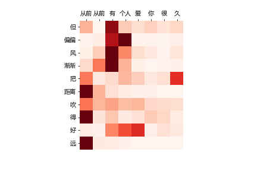
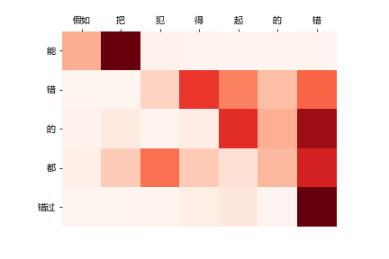

# Lyricist
### 基于Pytorch Seq2Seq 注意力机制的 中文歌词生成研究

#### 方法
* 用整个语料库预训练(pre-trian)50个epoch, 作为预训练模型  
* 在预训练的基础上用不同歌手的歌词进行微调(fine tune)  
* 歌词数据来源于自己爬虫搜集, 在本项目里只选了其中有代表性的40位歌手的作品, 如果换做更大语料库得到的效果会更好
* 核心代码完全代码基于Pytorch 和 torchtext  
* 注意力机制使用的是Luong Attention  

#### 效果
##### 用周杰伦的风格, 以一个句子开头写歌   
输入: `从前从前有个人爱你很久`

    但偏偏风渐渐把距离吹得好远,
    好不容易又能再多爱一天,
    但故事的最后你好像还是说了拜拜,
    只想要给我一首歌的时间, 
    你低头地亲吻我,
    我却微笑绝不说,
    认真的我都不说,
    琴弦的嘴却配着我的模样,
    那一块梦就像画一在那张里,
    而我看不见你的脸
   
前三句完全复现了原歌词  
"`只想要给我一首歌的时间`"引自《一首歌的时间》  
"`你低头地亲吻我`"引用了《以父之名》的"`低头亲吻我的左手`"  
"`我却微笑绝不说`"引用了《无双》的"`我却微笑绝不恋战`"  
"`琴弦的嘴却`"分别致敬了《天涯过客》的"`琴弦断了缘尽了你也走了`"和《她的睫毛》的"`她的睫毛弯的嘴角`"  
"`看不见你的脸`"影射了《彩虹》的"`看不见你的笑要我怎么睡得着`"  
对生成第一句歌词的注意力进行可视化:  
  

##### 用林俊杰的的风格, 以歌名开头写歌   
输入: `可惜没如果`

    假如把犯得起的错,
    能错的都错过,
    应该有那么懂得感情,
    都要在我的身边,
    所有的梦都忘记,
    我把心烧成火焰,
    让怕黑的你拥着温暖入眠,
    这一种加油不用回答,
    一直一直一直走在一起,
    你一直都想看我

前三句完全复现了原歌词  
"`应该有那么懂得感情`"影射了《小幸运》的"`爱上你的时候还不懂感情`"(乱入???)  
"`我把心烧成火焰`"和"`让怕黑的你拥着温暖入眠`"引用自《第几个一百天》的"`我把心烧成火焰`"  
"`这一种加油人人都需要`"致敬了《加油》的"`这一种加油人人都需要`"  
"`一直一直一直走在一起`"致敬了《精灵》的"`走在一起的画面`"  
对从第一句歌词生成第二句的注意力进行可视化:  
  

##### 用陈粒的风格写赵雷的《成都》
输入: `成都`

    遥远的阳光,
    快乐的背影,
    都是我,
    有一个完美的爱情,
    而我只属于你,
    在我的心里,
    啊你爱得,
    爱是那个梦,
    春是我,
    我住在七月的街头,
    看着我在这里,
    让我占有你的模样,
    趁一切还没能实现

##### 用周杰伦的风格重写林俊杰的《一千年以后》
输入: `一千年以后`

    我们不再被拥有,
    故事的声音,
    我们在地平线上睡着,
    不同的我们,
    我想我只能说的,
    拆这的感觉,
    好想再来唱我的妈妈,
    拿着读着的歌谣,
    把它忘在胸口里,
    记得那老的回忆,
    回忆是雨的下,
    哭得好了,
    那是下了力气,
    别再想那躲,
    别再想我

##### 用李荣浩的风格重写《李白》
输入: `李白`

    茫茫时空蔚蓝星球埋藏过往一段,
    一轮明月照出的是光明和呐喊,
    太阳光辉背后藏着深不见底的黑暗,
    无穷的力量掩盖的是可笑的背叛,
    英雄只能英雄都是一种鼓励,
    多少灯亮到现在我们都不懂,
    你的眼睛我的眼睛是一道伤痕累累,
    简单的音符就越简单,
    我知道你不喜欢什么,
    听你说的是谁的另一个,
    像诗说的就是什么,
    现在你算了我知道,
    因为你的好我还是,
    你的我

##### Author
欢迎交流  
wechat:`dengxiuqi007`  
2019.6
